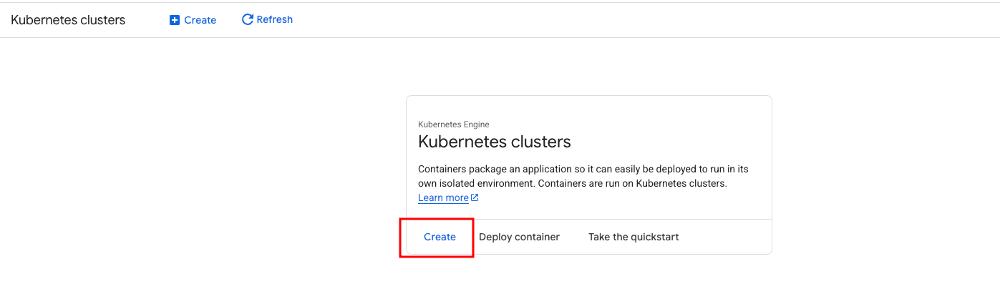
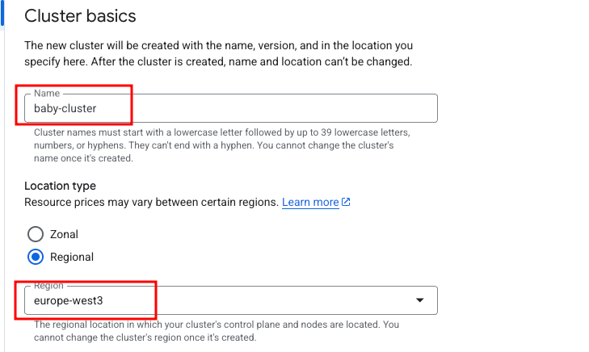
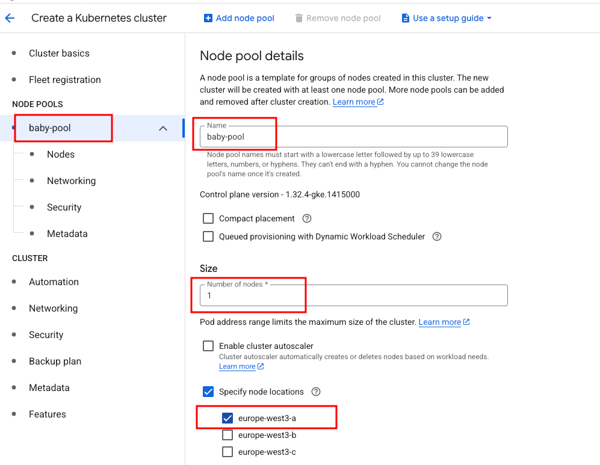
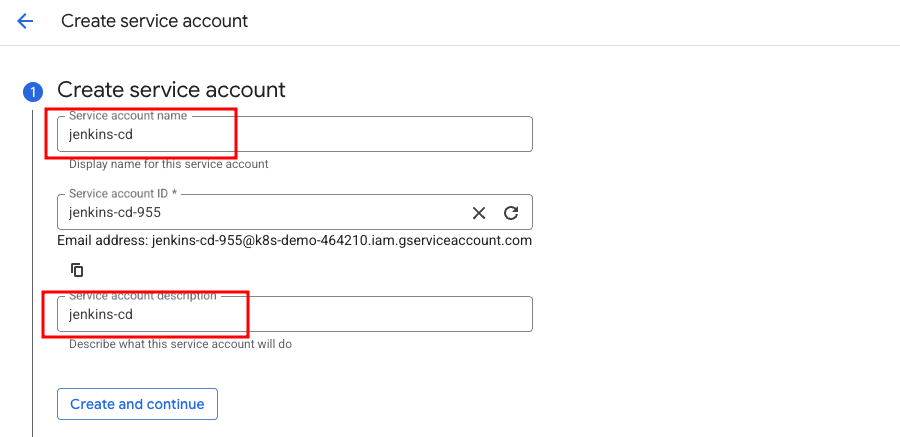
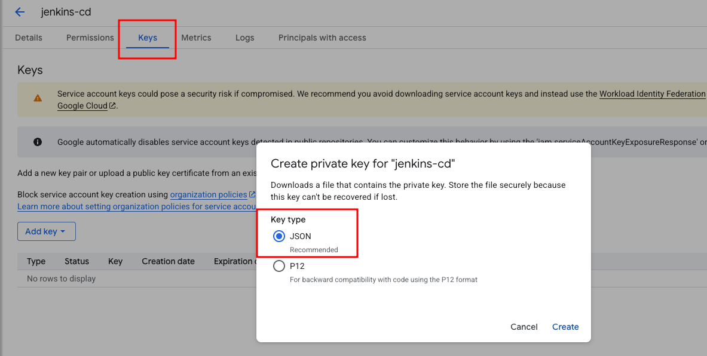
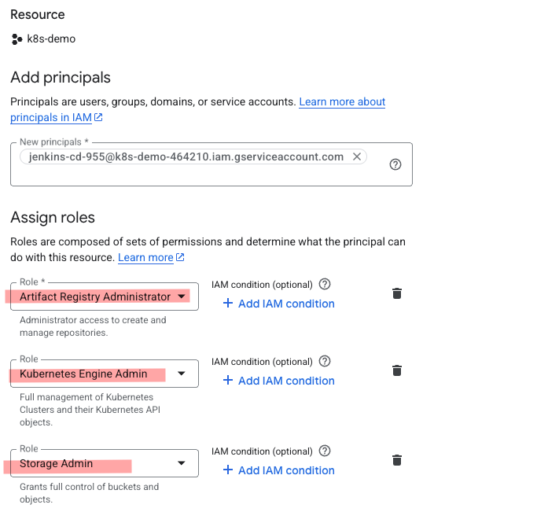

# How to Deploy application on GKE(Google Kubernetes Engine) using Jenkins Pipeline

Purpose of the this hands-on training is to teach how to build Jenkins pipeline to create Docker image, push the images to Google Artifact Registry and deploy them on Kubernetes Cluster.

## Learning Outcomes

At the end of the this hands-on training, will be able to;

- configure Jenkins Server with Git, Docker, gcloud CLI on Fedora/CentOS VM

- demonstrate how to build a docker image with Dockerfile.

- build Jenkins pipelines with Jenkinsfile.

- integrate Jenkins pipelines with GitHub using Webhook.

- use Docker commands effectively to tag, push, and pull images to/from Artifact Registry.

- Deploy application to kubernetes cluster using jenkins pipeline.

- delete images and repositories on Artifact Registry from the gcloud CLI

## Outline

- Part 1 - Launching a Jenkins Server Configured for Artifact Registry Management

- Part 2 - Setting up GKE(Google Kubernetes Engine) Cluster

- Part 3 - Integrate GKE(Google Kubernetes Engine) Cluster with Jenkins

- Part 4 - Create a Pipeline to Deploy an Application on GKE(Google Kubernetes Engine) Cluster


## Part 1 - Launching a Jenkins Server Configured for ECR Artifact Registry Management

- Launch a pre-configured `Jenkins Server`

- Open your Jenkins dashboard and navigate to `Manage Jenkins` >> `Manage Plugins` >> `Available` tab

- Search and select `Google Kubernetes Engine (GKE) Plugin` plugins, then click to `Install without restart`. Note: No need to install the other `Git plugin` which is already installed can be seen under `Installed` tab.

### Install kubectl binary with curl on Linux

- Download the latest release with the command:

```bash
curl -LO "https://dl.k8s.io/release/$(curl -L -s https://dl.k8s.io/release/stable.txt)/bin/linux/amd64/kubectl"
```

- Install kubectl

```bash
sudo install -o root -g root -m 0755 kubectl /usr/local/bin/kubectl
```
- Note:  If you do not have root access on the target system, you can still install kubectl to the ~/.local/bin directory:

```bash
chmod +x kubectl
mkdir -p ~/.local/bin
mv ./kubectl ~/.local/bin/kubectl
# and then append (or prepend) ~/.local/bin to $PATH
```


- After you install kubectl , you can verify its version with the following command:

```bash
kubectl version --client
```

- Copy the hands-on folder to jenkins server.


### Install the gcloud CLI (`https://cloud.google.com/sdk/docs/install#rpm`)

- Update DNF with gcloud CLI repository information. The following sample command is for a Red Hat Enterprise Linux 9-compatible installation, but make sure that you update the settings as needed for your configuration:

```bash
sudo tee -a /etc/yum.repos.d/google-cloud-sdk.repo << EOM
[google-cloud-cli]
name=Google Cloud CLI
baseurl=https://packages.cloud.google.com/yum/repos/cloud-sdk-el9-x86_64
enabled=1
gpgcheck=1
repo_gpgcheck=0
gpgkey=https://packages.cloud.google.com/yum/doc/rpm-package-key.gpg
EOM
```

- Install the gcloud CLI:

```bash
sudo dnf install google-cloud-cli
```

- Run gcloud init to get started:

```bash
gcloud auth login
```

## Part 2 - Setting up GKE(Google Kubernetes Engine) Cluster

-Click Create Cluster.



- Specify the name and region.



- Click Node Pool on the left tab. Specify the name, size, and node locations.



## Part 3 - Integrate GKE(Google Kubernetes Engine) Cluster with Jenkins

### Step-1 - Create IAM Service Account on GCP

- Create a service account. Specify a name and description.



- Leave other settings as default.

- Create.


- Go to the Key section and click Add key.  Create new key. Download a key in JSON format to your local machine.




- From the IAM menu, assign the following roles by clicking Grant access.

```text
Artifact Registry Administrator
Kubernetes Engine Admin
Kubernetes Engine Cluster Admin
Kubernetes Engine Developer
Storage Admin
```



### Step-2 - Create credentials for jenkins to manage GKE(Google Kubernetes Engine) Cluster 

- Open the Jenkins UI and navigate to `Manage Jenkins -> Credentials -> System -> Global Credentials`.

    - Kind: `Secret file`

    - File: `json file in the service account`

    - ID: `gcp-token` 

    - Description: `gcp-token`

- Credentials for GKE(Google Kubernetes Engine) Plugin

- Open the Jenkins UI and navigate to `Manage Jenkins -> Credentials -> System -> Global Credentials`.

    - Kind: `Google Service Account from private key`

    - JSON key: `json file in the service account`

    - ID: `gke-token` 

    - Description: `gke-token`

    - Project Name : `gke-token`


## Part 4 - Create a Pipeline to Deploy an Application on GKE(Google Kubernetes Engine) Cluster

### Step -1: Prepare github repo 

- Create a github repo named `microservice-phonebook-with-kubernetes-jenkins`.

- Check the key-value under `environment` in the Jenkinsfile.

- Execute the following commands in the microservice-phonebook-with-kubernetes-jenkins under the project folder.

```bash
git init
git add .
git commit -m "first commit"
git branch -M main
git remote add origin https://github.com/<github-username>/microservice-phonebook-with-kubernetes-jenkins.git
git push -u origin main 
```

### Step-2: Create Webhook 

- Go to the `microservice-phonebook-with-kubernetes-jenkins` repository page and click on `Settings`.

- Click on the `Webhooks` on the left hand menu, and then click on `Add webhook`.

- Copy the Jenkins URL from the AWS Management Console, paste it into `Payload URL` field, add `/github-webhook/` at the end of URL, and click on `Add webhook`.

```text
http://<jenkins-vm-public-ip>:8080/github-webhook/
```

### Step -3: Create a pipeline

```yaml
- job name: phonebook-gk8s
- job type: Pipeline
- Pipeline: 
      SCM: Git
      Repository URL: https://github.com/[your-github-account]/microservice-phonebook-with-kubernetes-jenkins.git
- Branches to build:
      Branch Specifier (blank for 'any'): main
- Build Triggers: GitHub hook trigger for GITScm polling
- Script Path: Jenkinsfile
```

- Click `Build Now`.

- Check the application on `gke-worker-node:30001` and `30002` ports.

- check the application from the `load-balancer-public-ip` created by ingress.

- Change something in the `microservice-phonebook-with-kubernetes-jenkins folder` and see that the app changes automatically.